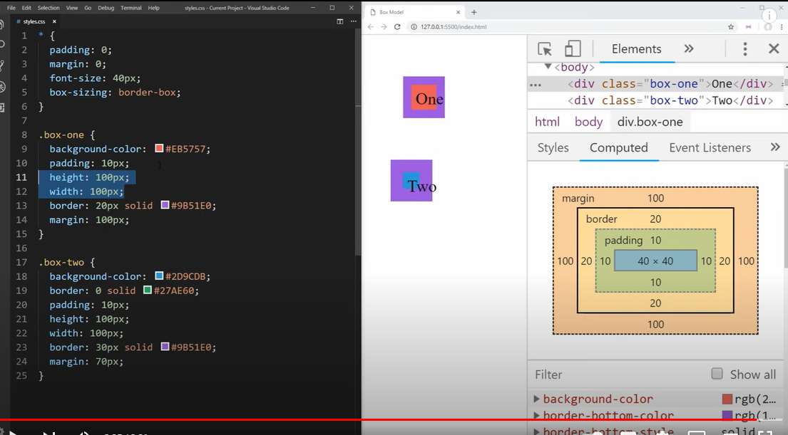

# git_test

# git
 * mkdir repos
 * cd repos
 *  git clone git@github.com:USER-NAME/REPOSITORY-NAME.git.
 * cd git_test
 * touch hello_world.txt.
 * git status
 * git add hello_world.txt
 * git status
 * git commit -m "Add hello_world.txt" 
 * git log
 * git add .
 * git push or git push origin main (Both accomplish the same goal in this context)

# Exit messgae screen git bash
* :wq! to escape messgaes screen 

# Html
* To create a link in HTML, we use the anchor element. 
* <a href="https://www.theodinproject.com/about">click me</a>

# Box-sizing  border-box;
* takes into accoutn P B M within widtha and height-good as default~Web dev simplified

```
<body>
    <h1 class="box-one">box 1 </h1>
    <h2 class="box-two">box 2 </h2>
</body>

* {
    padding: 0;
    margin: 0;
    font-size: 40px;
    box-sizing: border-box;
}

.box-one {
    background-color: red;
    padding: 10px;
    height: 100px;
    width: 100px;
    border: 20px solid purple;
    margin: 100px;
}

.box-one {
    background-color: rgb(25, 0, 255);
    border: 30px solid rgb(24, 167, 36);
    padding: 10px;
    height: 100px;
    width: 100px;
    border: 30px solid purple;
    margin: 70px;
}
```


# margin auto]
* auto and centering
Each of the margin properties can also accept a value of auto. A value of auto basically tells the browser to define the margin for you. In most cases, a value of auto will be equivalent to a value of 0 (which is the initial value for each margin property) or else whatever space is available on that side of the element. However, auto is handy for horizontal centering:

```
.container {
  width: 980px;
  margin: 0 auto;
}
```
In this example, two things are done to center this element horizontally within the available space:

The element is given a specified width
The left and right margins are set to auto
Without the specified width, the auto values would essentially have no effect, setting the left and right margins to 0 or else to whatever is the available space inside the parent element.

It should also be pointed out that auto is useful only for horizontal centering, and so using auto for top and bottom margins will not center an element vertically, which can be confusing for beginners.


-----------------------------------------------------------------------------


# Headers
# This is an 
<h1> tag
## This is an 
<h2> tag
###### This is an 
<h6> tag


# Code

```javascript
function test() {
console.log("look ma�, no spaces");
}
```

# Emphasis

*This text will be italic*
_This will also be italic_
**This text will be bold**
__This will also be bold__
*You **can** combine them*

# LISTS
## Unordered
* Item 1
* Item 2
	* Item 2a
	* Item 2b

## Ordered

1. Item 1
2. Item 2
3. Item 3
	* Item 3a
	* Item 3b

# IMAGES


Format: 

# LINKS

http://github.com - automatic!
[GitHub](http://github.com)

# BLOCKQUOTES

As Grace Hopper said:
> I�ve always been more interested
> in the future than in the past.

# BACKSLASH ESCAPES

\*literal asterisks\*
*literal asterisks*

Markdown provides backslash escapes for
the following characters:
\ backslash
` backtick
* asterisk
_ underscore
{} curly braces
[] square brackets
() parentheses
# hash mark
+ plus sign
- minus sign (hyphen)
. dot
! exclamation mark

# TASK LISTS

- [x] this is a complete item
- [ ] this is an incomplete item
- [x] @mentions, #refs, [links](),
**formatting**, and <del>tags</del>
supported
- [x] list syntax required (any
unordered or ordered list
supported)

# EMOJI

To see a list of every image we
support, check out www.emoji-cheat-sheet.com

GitHub supports emoji!
:+1: :sparkles: :camel: :tada:
:rocket: :metal: :octocat:

# TABLES
You can create tables by assembling
a list of words and dividing them
with hyphens - (for the first row),
and then separating each column
with a pipe | :

First Header | Second Header
------------ | -------------
Content cell 1 | Content cell 2
Content column 1 | Content column 2
-----------------------------------------------------------------------


